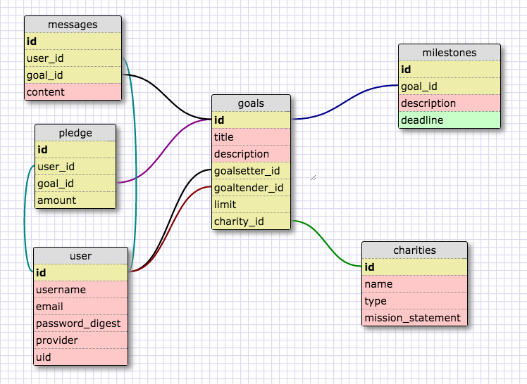

# [Motivator](https://protected-refuge-11475.herokuapp.com/)
#### A social web app that lets you set and achieve goals while supporting worthy causes.

Motivator is about achieving your own goals, and helping others achieve theirs, while raising money for charity. A user can be a **goal setter**, who sets a goal for himself and pledges a cash donation that he will make to the charity of his choice if he fails to achieve it.

Inspiring the goal setter toward success are **supporters**&mdash;users who pledge a donation to the user's chosen charity that will be made if the user succeeds in attaining his goal. So, if the goal setter achieves his goal, his supporters pay; if he is unsuccessful, the goal setter himself makes the donation.

But who decides if the goal was achieved? The **goal tender**, another user who has agreed to monitor the user's progress and eventual success. Motivator brings together goal setters, goal tenders, and supporters in a secure and social environment that makes it possible to do good work and good works at the same time!

Visit [Motivator](https://protected-refuge-11475.herokuapp.com/) in action!

## Features
* A rich online environment allowing users to interact with goals, milestones, charities, and one another!
* Login with a password-protected Motivator account, or through your Facebook
account.
* Search for users, goals, charities and even milestones using a search tool that makes case-insensitive matches of whole- and partial-word strings.
* Safely make donations to reputable charities through the Place2Give API, using Stripe's secure online payment system.
* Access Motivator's responsive website from any web-connected device!
* Follow events such as milestone progress and supporter pledges on all the goals you're following through Motivator's context-sensitive News Feed.
* Receive email notification when another user makes an action connected to any goal you've created, supported, or are tending.

#### Future features
* Full Facebook integration, with Motivator News Feed messages automatically forwarded to the timelines of users logged in through Facebook.
* Challenge goals, in which two or more goal setters compete head-to-head to complete goals, with the winner's charity receiving all the pledge money.

## Technology
* Ruby and Ruby on Rails
  * ActiveRecord
  * PostgreSQL
  * ActionMailer
* Javascript and jQuery
* HTML5 and CSS3
* omniauth-facebook - Facebook account authentication
* Place2Give Give-API - Charity information and verification
* Stripe payment APIs
* [Griddy](https://github.com/webdevjeffus/griddy) - responsive CSS framework

## Project Management
Motivator was created over a period of seven days following a simplified Agile development process. The team met for "sit-down stand-ups" at least three times a day: morning, after lunch, and close-of-day. We initially tracked our tasks on a Trello board, but without a formal Agile scrum master to maintain the Trello board, it was quickly replaced by the whiteboard that we updated during each stand-up. With all three team members working within fifteen feet of the whiteboard all day every day, this system kept everyone up to date without losing development time to updating a Trello board after each stand-up.

Now that our formal time at DBC is completed, and work on the project will be performed remotely, we will go back to the Trello board to manage further development.

## Resources
#### User Stories
The features and user experience of Motivator were laid out using a comprehensive set of
[User Stories](./planning/motivator_user_stories.md).

#### Schema
The schema underlying Motivator was created using the Dev Bootcamp Schema Designer tool.

## Credits
Motivator was created as a final project for the [Dev Bootcamp](http://devbootcamp.com/learn-ruby-javascript/overview/) web development immersive program.
#### Creators
Team members **Jeff George, Chris Guard,** and **Luis Plaz** collaborated on Motivator's database design and general Rails functionality. Specific individual contributions include:
* [Jeff George](http://webdevjeffus.github.io) - Newsfeed, Email notifactions, Facebook integration, Responsive CSS
* [Chris Guard](http://cguard90.github.io/) - Stripe payment, Database Search
* [Luis Fernando Plaz](http://www.luisplaz.com/) - Place2Give implementation, Front-end design

#### Faculty Advisors
* Steven Cassidy
* Chris DiMartino

